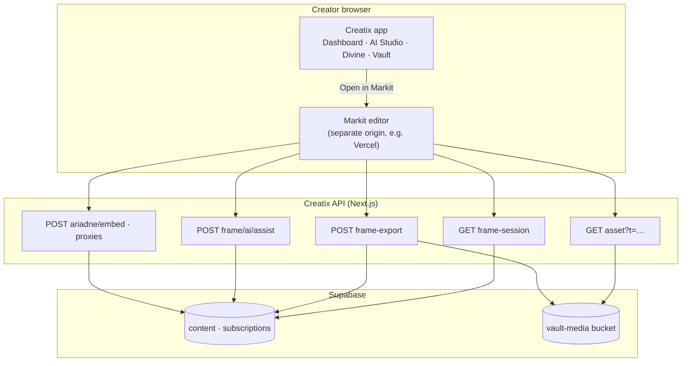
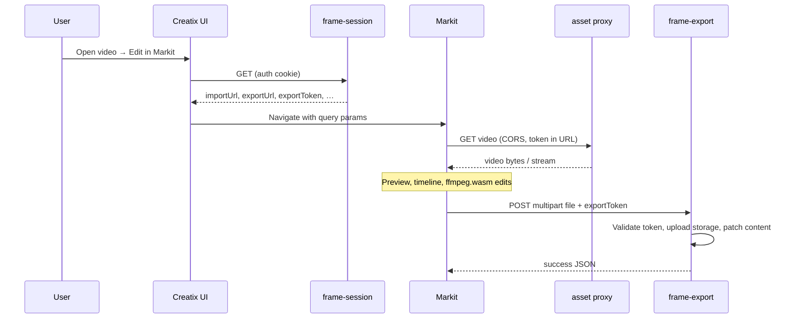
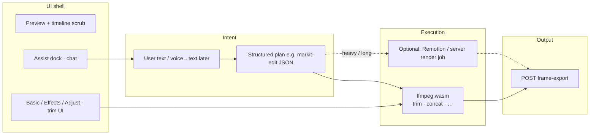
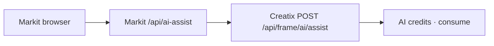
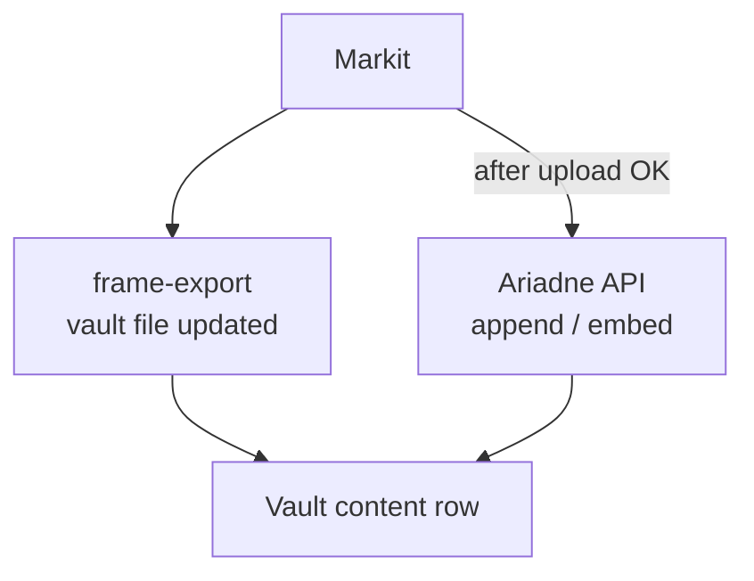
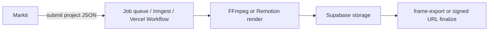

# Markit ↔ Creatix ecosystem — architecture outline

Single-page reference: how the **prompt/video editor** (Markit), **Creatix** (vault, auth, billing, AI credits), **browser media** (ffmpeg.wasm), optional **Remotion/worker render**, and **Ariadne** fit together.

---

## 1. High-level system context

**Principles**

- **Creatix** owns identity, vault rows, storage paths, AI credit debits, and Ariadne contracts.
- **Markit** is a **client** of those APIs: it never replaces Supabase as source of truth.
- **Divine** (messaging / panel flows) stays in Creatix; Markit is reached via **deep links** from AI Studio / vault, not merged into Divine UI unless you explicitly build that later.

---

## 2. Data flow: vault → edit → vault

Large exports **POST directly to Creatix** `frame-export` so Vercel body limits on Markit are not in the hot path.

---

## 3. Markit internal layers

- **Today:** wasm handles a defined set of operations (trim, concat from plans).
- **Later:** Remotion or a **worker** produces MP4 for complex compositions; upload contract to `frame-export` stays the same.

---

## 4. AI assist and billing

Bridge sessions use **Bearer exportToken**; logged-in Markit users can use session cookie through the same proxy pattern. Credits are debited on **Creatix**, not in Markit env.

---

## 5. Ariadne (trace / marker) after export

Forensic marker flows are **orthogonal** to editing: they operate on the **resulting** file in vault (subject to your existing credit and keying rules).

---

## 6. Optional future: render worker

Use when browser wasm is insufficient (long outputs, complex filters, Remotion compositions). Same **vault** and **content id** semantics; only **where** bytes are produced changes.

---

## 7. Reference projects (patterns only)

| Source            | Typical takeaway                                      |
|-------------------|--------------------------------------------------------|
| voidcut, proj     | Timeline UX, local-first wasm ops                      |
| Remotion          | Declarative compositions + server render path        |
| LosslessCut       | Fast trim/cut UX patterns                            |
| Kimu / others     | Full-app ideas; align infra with Creatix deliberately |

---

## 8. One-line summary

**Prompt/voice → validated edit plan → executor (wasm now, worker optional) → Creatix vault → optional Ariadne**, with **Creatix** as the only authority for auth, storage, credits, and vault rows.

---

## Related

- **Delivery plan:** [Creatix `docs/MARKIT_MASTER_PLAN.md`](https://github.com/Djoek47/Creatix/blob/main/docs/MARKIT_MASTER_PLAN.md)
